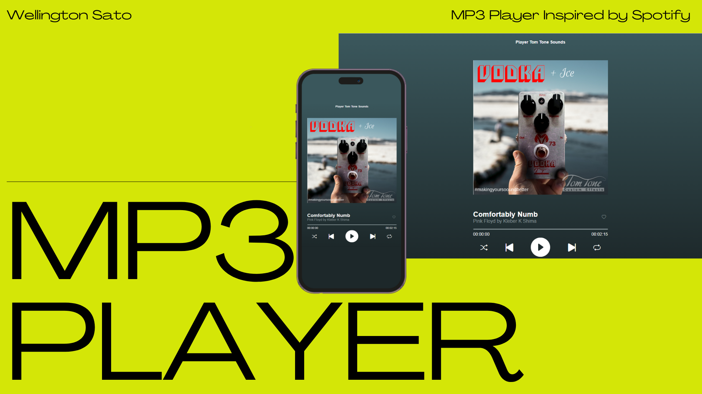

<h1 align="center"> MP3 Player </h1>

Programa Para Tocar Músicas MP3 Demosntrando os Timbres dos Pedais Tom Tone

  <a href="#-tecnologias">Tecnologias</a>&nbsp;&nbsp;&nbsp;|&nbsp;&nbsp;&nbsp;
  <a href="#-projeto">Projeto</a>&nbsp;&nbsp;&nbsp;|&nbsp;&nbsp;&nbsp;
  <a href="#-layout">Layout</a>&nbsp;&nbsp;&nbsp;|&nbsp;&nbsp;&nbsp;

  

 

  

## 🚀 Tecnologias

Esse projeto foi desenvolvido com as seguintes tecnologias:

- HTML e CSS
- JavaScript
- Git e Github

## 💻 Projeto

O MP3 Player estilo Spotify que executa exemplos de sons obtidos através dos pedais Tom Tone para servir de amostra à ser escutados online.

## 🔖 Layout

---
